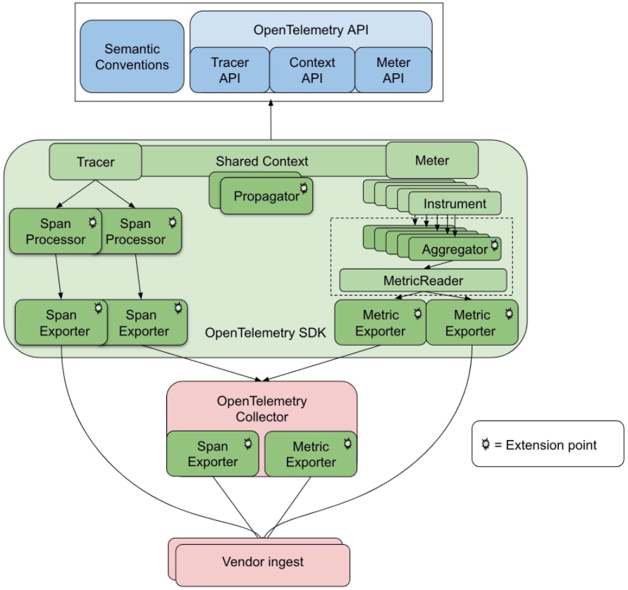

# 背景知识

本文档将介绍分布式链路追踪的背景知识，帮助您更好地理解 Maltose 框架中的链路追踪功能。

## 什么是分布式链路追踪？

分布式链路追踪（Distributed Tracing）是一种用于监控和诊断分布式系统中请求流程的技术。在微服务架构中，一个用户请求可能会经过多个服务处理，链路追踪技术可以帮助开发者了解请求在整个系统中的流转路径、各个环节的耗时以及可能出现的问题。

链路追踪的核心价值在于：

1. **可视化请求流程**：直观展示请求在分布式系统中的完整路径
2. **性能分析**：识别系统中的性能瓶颈和优化机会
3. **故障排查**：快速定位分布式系统中的错误和异常
4. **依赖分析**：了解服务间的调用关系和依赖程度

## OpenTelemetry 简介

`OpenTelemetry` 是一个开源的可观测性框架，旨在标准化遥测数据（如链路、指标和日志）的收集和传输。它是由 OpenTracing 和 OpenCensus 项目合并而来，目标是提供一套统一的、厂商中立的工具和 API，用于收集和导出可观测性数据。

Maltose 框架的链路追踪功能基于 `OpenTelemetry` 实现，这意味着您可以轻松地将追踪数据导出到各种后端系统，如 Jaeger、Zipkin、Prometheus 等。

## 链路追踪的核心概念

我们先看看 `OpenTelemetry` 的架构图，我们这里不会完整介绍，只会介绍其中大家常用的几个概念。 关于 `OpenTelemetry` 的内部技术架构设计介绍，可以参考 `OpenTelemetry` 架构，关于语义约定请参考： https://github.com/open-telemetry/opentelemetry-specification/blob/main/specification/trace/api.md



### TracerProvider

主要负责创建 `Tracer`，一般是需要第三方的分布式链路跟踪管理平台提供具体的实现。默认情况是一个空的 `TracerProvider (NoopTracerProvider)`，虽然也能创建 Tracer 但是内部其实不会执行具体的数据流传输逻辑。

### Tracer

`Tracer` 负责创建 `Span`，是链路追踪的入口点。每个服务或模块通常会使用一个命名的 Tracer 实例。

```go
// 获取 Tracer
tracer := tp.Tracer("my-module")

// 创建 Span
ctx, span := tracer.Start(ctx, "operation-name")
```

### Span

Span 是链路追踪的基本单位，表示一个操作或工作单元。每个 Span 包含以下信息：

- **名称**：描述操作的名称
- **开始和结束时间**：操作的持续时间
- **属性（Attributes）**：键值对形式的元数据
- **事件（Events）**：带时间戳的日志事件
- **状态**：操作是否成功
- **父 Span**：当前 Span 的父 Span（如果有）

Span 之间的关系形成了一个树状结构，称为 Trace（追踪）。一个 Trace 由一个根 Span（Root Span）和多个子 Span 组成。

```go
// 创建 Span
ctx, span := trace.NewSpan(ctx, "operation-name")
defer span.End()

// 添加属性
span.SetAttributes(attribute.String("key", "value"))

// 记录事件
span.AddEvent("event-name")

// 记录错误
span.RecordError(err)
```

### Attributes（属性）

Attributes 是附加到 Span 上的键值对，用于提供额外的上下文信息。例如，您可以添加 HTTP 请求的方法、URL、状态码等信息作为属性。

```go
span.SetAttributes(
    attribute.String("http.method", "GET"),
    attribute.String("http.url", "https://example.com/api"),
    attribute.Int("http.status_code", 200),
)
```

### Events（事件）

Events 是带有时间戳的日志事件，记录在 Span 的生命周期内发生的重要事件。

```go
span.AddEvent("cache.miss")
span.AddEvent("db.query.start", trace.WithAttributes(
    attribute.String("db.statement", "SELECT * FROM users"),
))
```

### SpanContext

SpanContext 包含跨服务传播所需的信息，主要包括：

- **TraceID**：全局唯一的追踪标识符，标识整个请求链路
- **SpanID**：当前 Span 的唯一标识符
- **TraceFlags**：追踪标志，如采样决策
- **TraceState**：供应商特定的状态信息

SpanContext 是不可变的，可以通过 HTTP 头、gRPC 元数据等方式在服务间传递。

### Propagator（传播器）

Propagator 负责在服务间传递 SpanContext，确保链路追踪信息能够跨服务边界传播。OpenTelemetry 提供了多种传播格式，如 W3C TraceContext、B3、Jaeger 等。

在 Maltose 中，我们默认使用 W3C TraceContext 格式进行传播，这是一个标准化的格式，被广泛支持。

```go
// HTTP 客户端传播示例
req, _ := http.NewRequestWithContext(ctx, "GET", url, nil)
otel.GetTextMapPropagator().Inject(ctx, propagation.HeaderCarrier(req.Header))

// HTTP 服务端提取示例
ctx = otel.GetTextMapPropagator().Extract(req.Context(), propagation.HeaderCarrier(req.Header))
```

在 Maltose 中，这些传播逻辑已经在中间件和 HTTP 客户端中自动处理，您无需手动编写这些代码。

### Baggage

Baggage 是一种在服务间传递键值对的机制，类似于 SpanContext，但用于传递自定义的上下文信息。与 SpanContext 不同，Baggage 中的信息不会直接显示在追踪系统中，而是需要显式地添加到 Span 的属性中才能可见。

```go
// 设置 Baggage
ctx = baggage.ContextWithValues(ctx,
    attribute.String("user.id", "123"),
    attribute.String("tenant.id", "456"),
)

// 获取 Baggage
bag := baggage.FromContext(ctx)
userID := bag.Member("user.id").Value()
```

## 采样策略

采样是控制哪些追踪数据被收集和导出的机制。OpenTelemetry 提供了多种采样策略：

1. **AlwaysOn**：收集所有追踪数据
2. **AlwaysOff**：不收集任何追踪数据
3. **TraceIDRatioBased**：基于 TraceID 的概率采样
4. **ParentBased**：基于父 Span 的采样决策

在 Maltose 中，默认使用 AlwaysOn 采样策略，您可以根据需要进行配置：

```go
tp, err := trace.InitTracer(trace.Config{
    ServiceName: "my-service",
    Endpoint:    "http://localhost:14268/api/traces",
    SamplingRate: 0.1, // 10% 采样率
})
```

## 总结

了解这些背景知识将帮助您更好地理解和使用 Maltose 框架中的链路追踪功能。在后续文档中，我们将详细介绍如何在 Maltose 中配置和使用链路追踪，以及一些最佳实践。

## 参考资料

- https://opentracing.io
- https://opencensus.io
- https://opentelemetry.io
- https://github.com/open-telemetry/opentelemetry-specification/tree/main/specification
- https://goframe.org/docs/obs/tracing-intro
